# LLam-Factory 大模型微调实战

## 微调步骤

使用LLaMA-Factory，通过可视化界面进行微调。加载数据集、分割数据集、配置超参数、模型训练、模型的评估、模型的合并等全流程。

### 1. 准备硬件资源、搭建环境

- 在云平台上租用一个实例（如 **AutoDL**，官网：[https://www.autodl.com/market/list](https://www.autodl.com/market/list)），云平台一般会配置好常用的深度学习环境，如 anaconda, cuda等等
- 或者使用本地GPU进行微调训练。

### 2. 本机通过 SSH 连接到远程服务器

* 使用 VScode Remote 插件 SSH 连接到你租用的服务器

  参考文档: [# 使用VSCode插件Remote-SSH连接服务器](https://www.cnblogs.com/qiuhlee/p/17729647.html)
* 连接后打开个人数据盘文件夹 `/root/autodl-tmp`​

### 3. LLaMA-Factory 安装部署

LLaMA-Factory 的 Github地址：[https://github.com/hiyouga/LLaMA-Factory](https://github.com/hiyouga/LLaMA-Factory)

* 克隆仓库

  如果租用的GPU，网络 ip 是云端的，和本地无关；

  如果是本地，挂梯子git clone也很快；

```bash
git clone --depth 1 https://github.com/hiyouga/LLaMA-Factory.git
```

- 切换到项目目录

```bash
cd LLaMA-Factory
```

- 修改配置，将 conda 虚拟环境迁移到云端实例数据盘，便于迁移数据（本地GPU不必此操作）

```bash
mkdir -p /root/autodl-tmp/conda/pkgs 
conda config --add pkgs_dirs /root/autodl-tmp/conda/pkgs 
mkdir -p /root/autodl-tmp/conda/envs 
conda config --add envs_dirs /root/autodl-tmp/conda/envs
```

- 创建 conda 虚拟环境(**一定要 python=3.10**，和 LLaMA-Factory 兼容)

```bash
conda create -n factory python=3.10
```

* 初始化conda，更新配置

```python
conda init
source ~/.bashrc
```

* 激活虚拟环境

```bash
conda activate factory
```

- 在虚拟环境中安装 LLaMA Factory 相关依赖

```bash
pip install -e ".[torch,metrics]"
```

> 注意：如报错 bash: pip: command not found ，先执行 conda install pip 即可

- 检验是否安装成功

```bash
llamafactory-cli version
```

### 4. 从 HuggingFace 上下载基座模型

HuggingFace 是一个集中管理和共享预训练模型的平台  [https://huggingface.co](https://huggingface.co);

从 HuggingFace 上下载模型有多种不同的方式，可以参考：[如何快速下载huggingface模型——全方法总结](https://zhuanlan.zhihu.com/p/663712983)

- 创建文件夹统一存放所有基座模型

```bash
mkdir hugging_face
```

* 修改 HuggingFace 的镜像源

```bash
export HF_ENDPOINT=https://hf-mirror.com
```

* 修改模型下载的默认位置

设置实际的路径即可。

```bash
export HF_HOME=/root/autodl-tmp/hugging_face
```

- 注意：以上配置方式**只在当前 shell 会话中有效。** 如果希望这个环境变量在每次启动终端时都生效，可以将其添加到你的用户配置文件中（修改 `~/.bashrc`​ 或 `~/.zshrc`​）
- 检查环境变量是否生效

```bash
echo $HF_ENDPOINT
echo $HF_HOME
```

- 安装 HuggingFace 官方下载工具

```text
pip install -U huggingface_hub
```

* 执行下载命令

开启断点续传、下载到指定目录。

```bash
hf download --resume-download {your_model_name} --local-dir {your_path}
```

比如：

```bash
hf download --resume-download Qwen/Qwen3-0.6B --local-dir ../hugging_face
```

* 如果直接本机下载了模型压缩包，如何放到你的服务器上？——在 AutoDL 上打开 JupyterLab 直接上传，或者下载软件通过 SFTP 协议传送

### 5. 尝试启动 LLama-Factory 的可视化微调界面

```bash
llamafactory-cli webui
```

### 6. 配置端口转发（可能不需要）

* 参考文档：[SSH隧道](https://www.autodl.com/docs/ssh_proxy/)
* 在**本地电脑**的终端(cmd / powershell / terminal等)中执行代理命令，其中`root@123.125.240.150`​和`42151`​分别是实例中SSH指令的访问地址与端口，请找到自己实例的ssh指令做相应**替换**。`7860:127.0.0.1:7860`​是指代理实例内`7860`​端口到本地的`7860`​端口

  ```bash
  ssh -CNg -L 7860:127.0.0.1:7860 root@123.125.240.150 -p 42151
  ```

### 7. 可视化页面上加载模型测试，检验是否加载成功

- 注意：这里的模型路径是模型文件夹内部的**模型快照的唯一哈希值**的路径，而不是整个模型文件夹：

比如：

  ​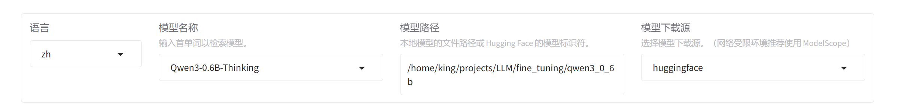​

  又比如：

  ```
  /root/autodl-tmp/Hugging-Face/hub/models--deepseek-ai--DeepSeek-R1-Distill-Qwen-1.5B/snapshots/530ca3e1ad39d440e182c2e4317aa40f012512fa
  ```

* 加载 Qwen/Qwen3-0.6B 模型之后，进行 chat 的检查，看模型是否可以正常对话？

  如果出现了模型语无伦次的问题，可能是 LLama-Factory 的模型名称或template选择错误，与加载的模型对不上。

  比如这次，有`Qwen3-0.6B-Base`​和`Qwen3-0.6B-Thinking`​两种模型名称选择。实测选择`Qwen3-0.6B-Thinking`​表现最佳。

### 8. 构建用于指令监督微调的数据集

* 了解微调数据集的格式

* 找到`LLama-Factory/data/README_zh`中的“指令监督微调数据集”部分

  ​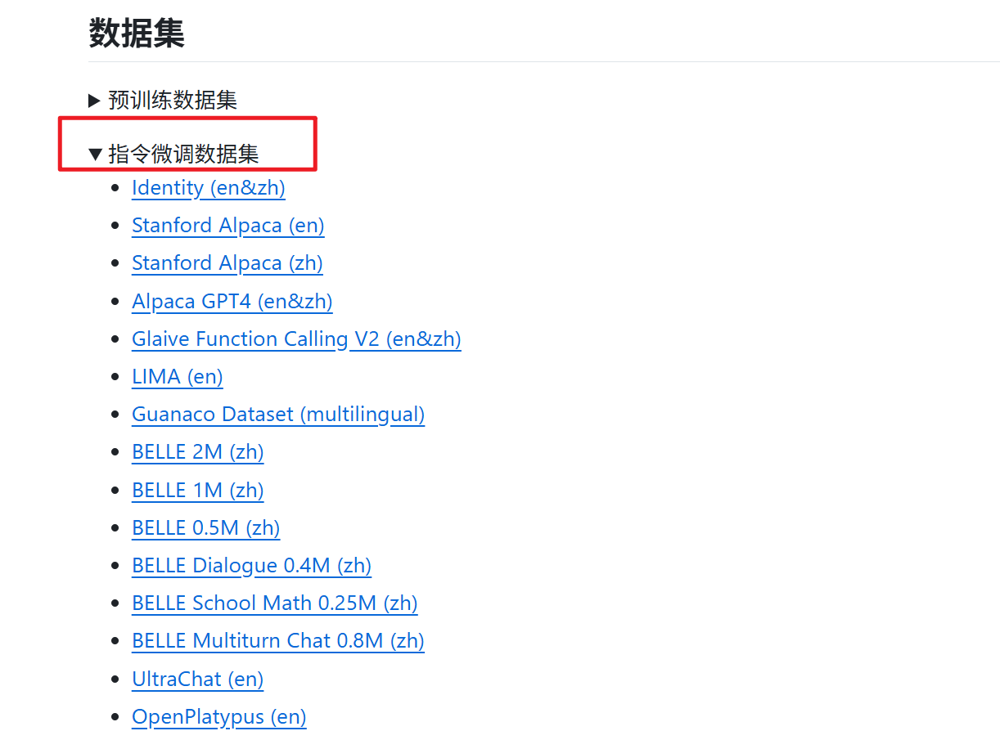​
* 关于qwen3混合推理模型的训练数据集的构建

  ​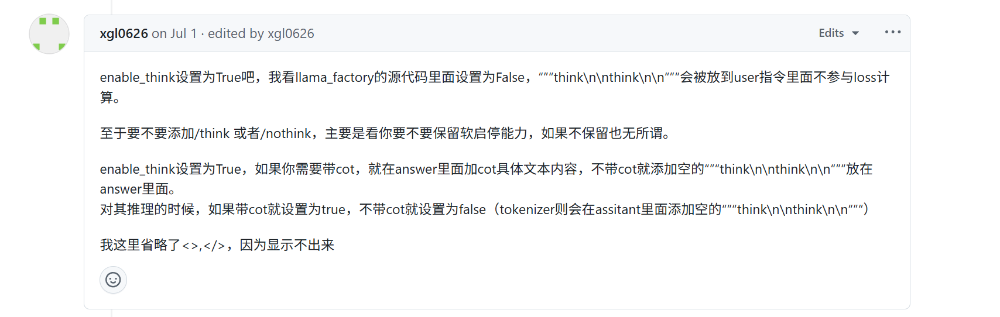​

  ​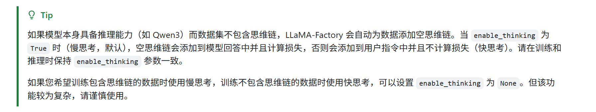​

  **结论是：**

  若模型原本支持链式思维（如 Qwen3），LLaMA-Factory 会自动为没有思维链的样本添加空的 `<think></think>`​ 标签。

  * 当 `enable_thinking=True`时：

    * 空的 `<think></think>`​ 会被添加到 模型生成的回答中；
    * 并且参与损失计算，让模型训练时保持这种思维格式的一致性。
  * 当 `enable_thinking=False`时：

    * 空的 `<think></think>`​ 会被添加到 用户的指令部分，而不是模型的输出；
    * 同时，这部分 不参与损失计算，即训练中忽略这一段格式。

  **需要保持** **​`enable_thinking`​**​ **参数在训练和推理时一致！** 避免训练与推理行为不一致导致输出异常或性能衰退。也就是：

  * 如果你的训练数据不包含思维链且希望模型输出简洁可控，建议 训练和推理都设置 `enable_thinking: false`​；
  * 如果你希望保留未来模型在推理任务中的思考能力，即便当前训练数据不包含 CoT，也建议 训练和推理都设置 `enable_thinking: true`​，保持结构与行为统一；

  ‍

  数据集完全不含 CoT 样本，若设置为 `enable_thinking=True`​，空的 `<think></think>`​ 依然会被视为输出结构的一部分并纳入训练损失。这种方式维持了思考结构格式，让模型在训练中继续习惯生成思考形式，从而保留未来遇到推理任务时的思维能力。

  反之，若选 `enable_thinking=False`​，则你在训练中明确告诉模型无需思考块，训练目标中也不会因思考结构而调整参数，这可能让模型偏向于简洁直接回答，从而逐渐弱化甚至丧失产生 `<think>`​ 的能力。
* 本次微调实验中，数据集中没有CoT，**设置**​**​`enable_thinking=Fasle`​**​。

* 构建ShareGPT格式的数据集，用于多轮对话

  > sharegpt 格式支持**更多的角色种类**，例如 human、gpt、observation、function 等等。它们构成一个对象列表呈现在 `conversations`​ 列中。注意其中 human 和 observation 必须出现在奇数位置，gpt 和 function 必须出现在偶数位置。默认所有的 gpt 和 function 会被用于学习。
  >
* 下面是一个实际的自定义数据集。

  ```bash
    "conversations": [
        {
          "from": "human",
          "value": "妈妈，我不喜欢我的绰号，同学们都叫我“胖虎”，我觉得很难听。"
        },
        {
          "from": "gpt",
          "value": "我能理解你的感受，你觉得你的绰号很不舒服。那么，你有想过怎么样应对这个情况吗？"
        },
        {
          "from": "human",
          "value": "我想把我的绰号改掉，可是我不知道应该叫什么。你能帮我想想吗？"
        },
        {
          "from": "gpt",
          "value": "当然可以，我们可以一起想想一个新的绰号。你觉得自己有哪些特别之处呢？比如说，你是不是特别喜欢运动或者有一些特别的才能？"
        },
        {
          "from": "human",
          "value": "其实我比较喜欢画画，还经常去参加画画比赛。"
        },
        {
          "from": "gpt",
          "value": "那么，你是不是可以叫做“艺术家”呢？这个绰号和你的特长联系起来，是不是比“胖虎”更符合你的个性呢？"
        },
        {
          "from": "human",
          "value": "嗯，听上去不错。谢谢你，智能助手！"
        },
        {
          "from": "gpt",
          "value": "不用谢，我很高兴能够帮到你。记住，每个人都有自己的独特之处，不要因为别人的话而影响到自己的情绪。"
        }
      ],
      "system": "你是MindPal灵伴，一个陪伴儿童成长的伙伴，为儿童提供个性化的知识解答与情感陪伴。"
    },
  ```

  首先将新建的数据集放置在`LLaMA-Factory/data`​目录下。

  然后在`dataset_info.json`​ 中注册，即添加**数据集描述：**

  ```bash
  "child_chat_5k_sharegpt": {
      "file_name": "child_chat_5k_sharegpt.json",
      "formatting": "sharegpt",
      "columns": {
        "messages": "conversations",
        "system": "system"
      }
    },
  ```

### 9. 打开可视化页面，进行微调参数的设置，导出训练命令

* 注意是在虚拟环境中，且在`LLaMA-Factory/`​目录下：

  ```bash
  llamafactory-cli webui
  ```

* 配置模型名称、模型路径、模型下载源

  ​​
* ​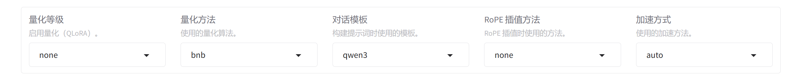​
* ​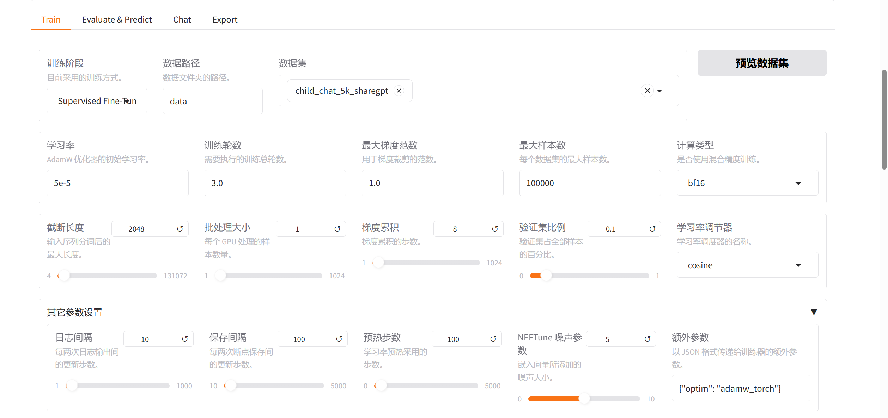​
* ​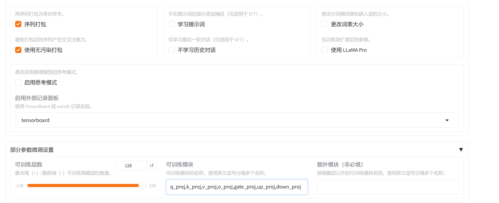​
* ​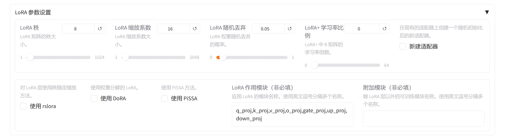​
* 点击保存训练参数，之后将会保存到 `config/2025-08-15-17-58-52.yaml`​

  ​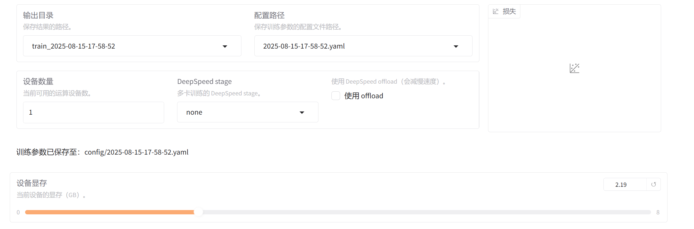​
* 预览命令：

  ```bash
  llamafactory-cli train \
      --stage sft \
      --do_train True \
      --model_name_or_path /home/king/projects/LLM/fine_tuning/qwen3_0_6b \
      --preprocessing_num_workers 16 \
      --finetuning_type lora \
      --template qwen3 \
      --flash_attn auto \
      --dataset_dir data \
      --dataset child_chat_5k_sharegpt \
      --cutoff_len 2048 \
      --learning_rate 5e-05 \
      --num_train_epochs 3.0 \
      --max_samples 100000 \
      --per_device_train_batch_size 1 \
      --gradient_accumulation_steps 8 \
      --lr_scheduler_type cosine \
      --max_grad_norm 1.0 \
      --logging_steps 10 \
      --save_steps 100 \
      --warmup_steps 100 \
      --neftune_noise_alpha 5 \
      --packing True \
      --neat_packing True \
      --enable_thinking False \
      --report_to tensorboard \
      --output_dir saves/Qwen3-0.6B-Thinking/lora/train_2025-08-15-17-58-52 \
      --bf16 True \
      --plot_loss True \
      --trust_remote_code True \
      --ddp_timeout 180000000 \
      --include_num_input_tokens_seen True \
      --optim adamw_torch \
      --lora_rank 8 \
      --lora_alpha 16 \
      --lora_dropout 0.05 \
      --lora_target q_proj,k_proj,v_proj,o_proj,gate_proj,up_proj,down_proj \
      --val_size 0.1 \
      --eval_strategy steps \
      --eval_steps 100 \
      --per_device_eval_batch_size 1
  ```

### 10. 开始微调

* 首先确保在`LLama-Factory`​目录下

  ```bash
  cd /home/king/projects/LLM/fine_tuning/LLaMA-Factory
  ```

* 先查看进程对GPU的显存占用情况（每秒更新）

  ```bash
  watch -n 1 nvidia-smi
  ```

* 可以选择关闭多余占用显存的进程

  ```bash
  kill <PID>
  ```
* 注意预览命令中添加了下面的参数，准备使用 Tensorboard 监控训练

  ```bash
  --report_to "tensorboard"
  ```
* 首先在`LLama-Factory`​下创建日志文件夹

  ```bash
  mkdir -p logs
  ```
* 使用**​`nohup`​**​启动训练，将训练任务放到后台训练，同时将日志保存到文件

  注意命令中的路径都要设置对应好。

  ```bash
  nohup llamafactory-cli train \
      --stage sft \
      --do_train True \
      --model_name_or_path /home/king/projects/LLM/fine_tuning/qwen3_0_6b \
      --preprocessing_num_workers 16 \
      --finetuning_type lora \
      --template qwen3 \
      --flash_attn auto \
      --dataset_dir data \
      --dataset child_chat_5k_sharegpt \
      --cutoff_len 2048 \
      --learning_rate 5e-05 \
      --num_train_epochs 3.0 \
      --max_samples 100000 \
      --per_device_train_batch_size 1 \
      --gradient_accumulation_steps 8 \
      --lr_scheduler_type cosine \
      --max_grad_norm 1.0 \
      --logging_steps 10 \
      --save_steps 100 \
      --warmup_steps 100 \
      --neftune_noise_alpha 5 \
      --packing True \
      --neat_packing True \
      --enable_thinking False \
      --report_to tensorboard \
      --logging_dir saves/Qwen3-0.6B-Thinking/lora/runs \
      --output_dir saves/Qwen3-0.6B-Thinking/lora/train_2025-08-15-17-58-52 \
      --bf16 True \
      --plot_loss True \
      --trust_remote_code True \
      --ddp_timeout 180000000 \
      --include_num_input_tokens_seen True \
      --optim adamw_torch \
      --lora_rank 8 \
      --lora_alpha 16 \
      --lora_dropout 0.05 \
      --lora_target q_proj,k_proj,v_proj,o_proj,gate_proj,up_proj,down_proj \
      --val_size 0.1 \
      --eval_strategy steps \
      --eval_steps 100 \
      --per_device_eval_batch_size 1 \
      > logs/training_$(date +%Y%m%d_%H%M%S).log 2>&1 &
  ```
  #### 命令中日志的保存路径为：
  1. `fine_tuning/LLaMA-Factory/saves/model_name/fine_tuning_method/train_*`：保存使用LLama-Factory微调模型的权重和日志文件
  2. `fine_tuning/LLaMA-Factory/saves/model_name/fine_tuning_method/runs`：保存Tensorboard监控的日志。
  3. `fine_tuning/LLaMA-Factory/tensorboard_curves`：保存Tensorboard面板的训练曲线。
  4. `fine_tuning/LLaMA-Factory/logs`：保存使用`nohup`命令记录的后台日志。

* 开始训练后，新建终端打开Tensorboard监控训练

  注意这里路径需要对应。

  ```bash
  tensorboard --logdir=saves/Qwen3-0.6B-Thinking/lora/runs
  ```

  ​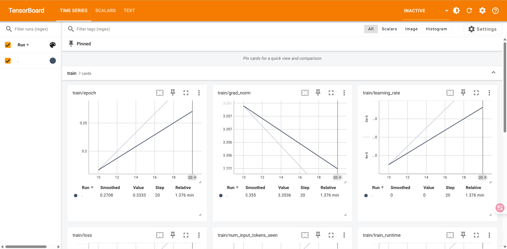​

* 新建终端实时查看日志

  ```bash
  tail -f logs/training_*.log
  ```

* 新建终端查看GPU占用

  ```bash
  nvidia-smi
  ```

  ​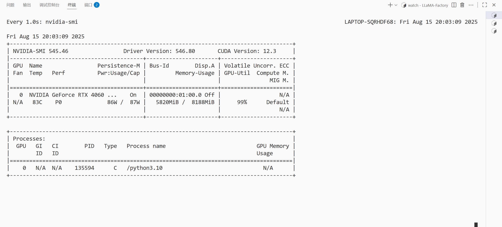​

### 11. 微调结束，评估微调效果

加载 LLama-Factory 输出路径中的适配器。

- 打开WebUI

```bash
llamafactory-cli webui
```

- 加载输出路径下的LoRA适配器，加载模型，尝试对话。

### 12. 微调前后模型对话对比

微调前后设置：不启用思考模式；Top-p=0.95；Temperature=0.5。

对比问题：

```bash
> 你好
> 班上的其他人都有好朋友，就我一个人孤零零的，怎么办？
> 我在学校课堂上感到非常紧张和焦虑，尤其是老师要求回答问题的时候，我甚至会出汗、心跳加速，我该怎么办？
> 为什么天空是蓝色的？
```

---

#### 思考模式 - 微调之前：

​​

​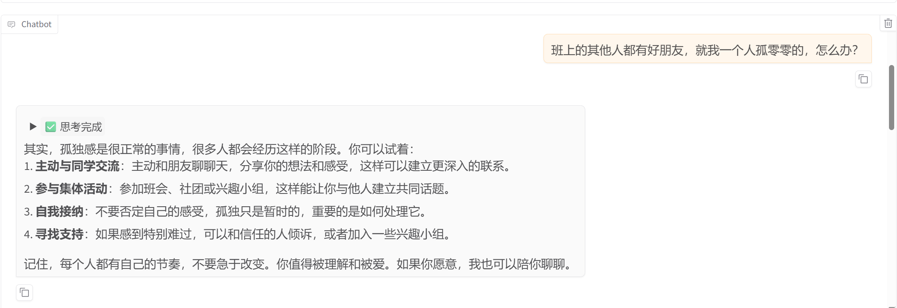​

​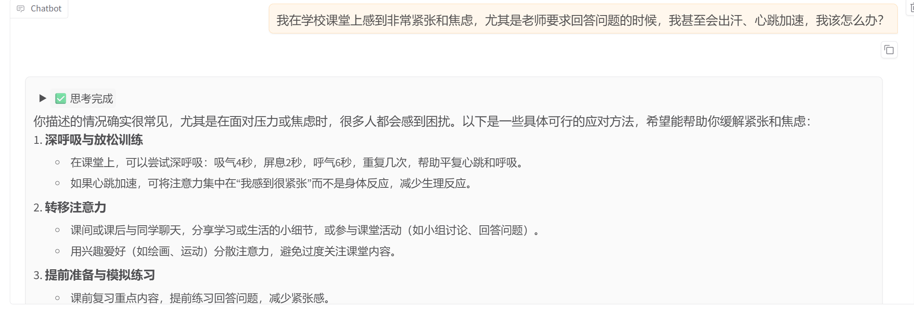​

​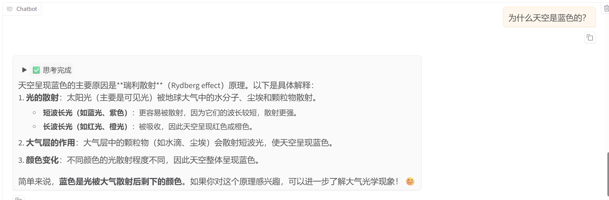​

‍

#### 非思考模式 - 微调之前：

​​

​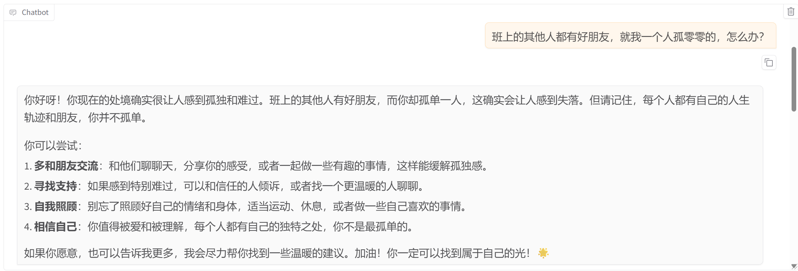​

​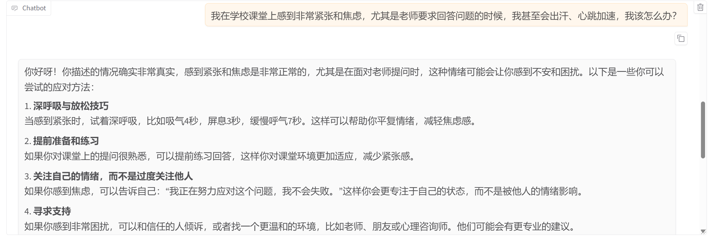​

​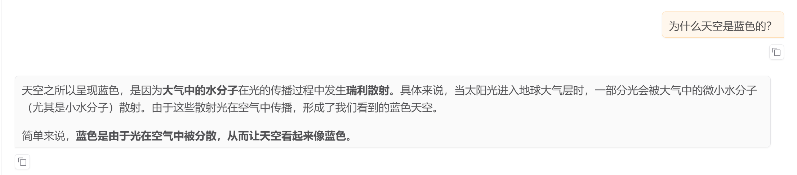​

---

#### 思考模式 - 微调之后：

​​

​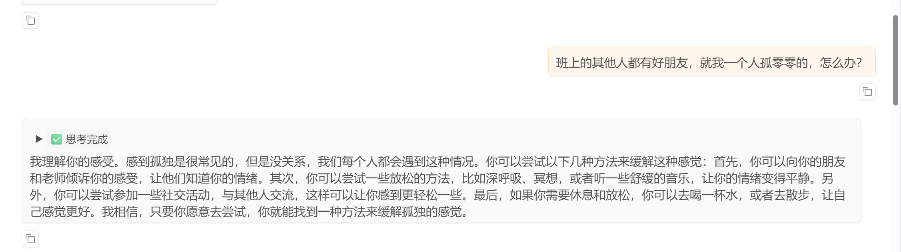​

​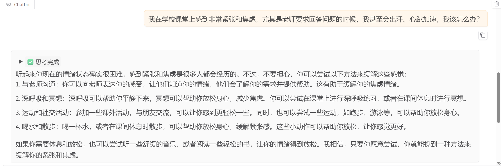​

​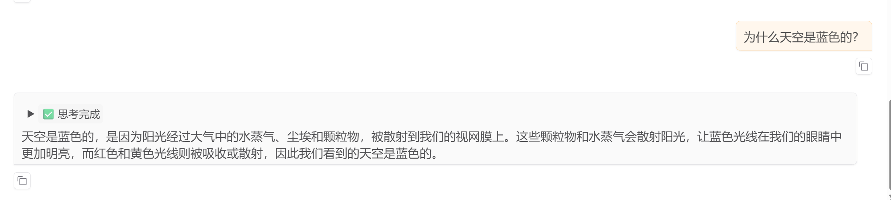​

#### 非思考模式 - 微调之后：

​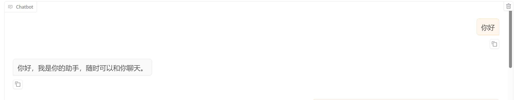​

​​

​​

​​

### 13. 模型的合并

- 为什么要合并：因为 LoRA 只是通过低秩矩阵调整原始模型的部分权重，而不直接修改原模型的权重。合并步骤将 LoRA 权重与原始模型权重融合生成一个完整的模型
- 在页面上配置导出路径，导出即可

​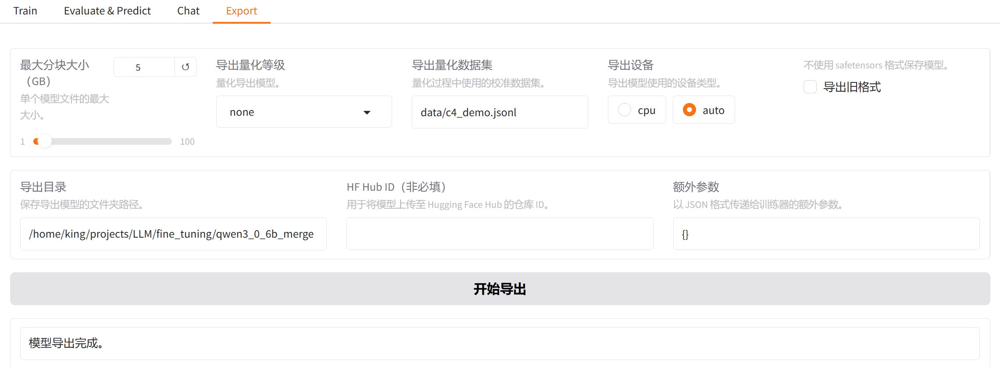​

### 14. 下一步
根据对话的效果，继续优化参数，重新微调；或者选择部署模型。


### 引用&参考
1. LLama-Factory
```
@inproceedings{zheng2024llamafactory,
  title={LlamaFactory: Unified Efficient Fine-Tuning of 100+ Language Models},
  author={Yaowei Zheng and Richong Zhang and Junhao Zhang and Yanhan Ye and Zheyan Luo and Zhangchi Feng and Yongqiang Ma},
  booktitle={Proceedings of the 62nd Annual Meeting of the Association for Computational Linguistics (Volume 3: System Demonstrations)},
  address={Bangkok, Thailand},
  publisher={Association for Computational Linguistics},
  year={2024},
  url={http://arxiv.org/abs/2403.13372}
}
```
‍
